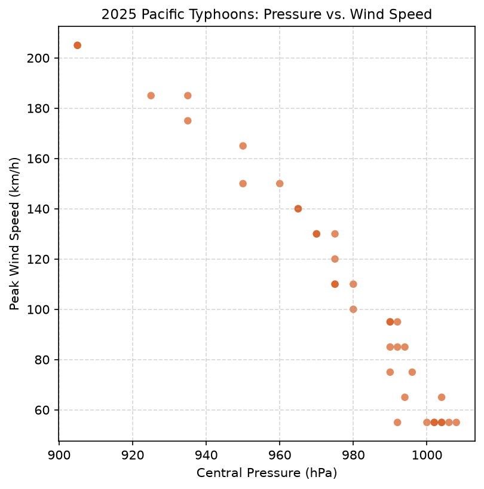

# The phenomenon

<!-- This is the SD5913 assignment 2 template. Everything in this file is yours to
replace, and the check counts words: comments like this one are not words, so
delete each one as you write. Start with the heading: name the phenomenon.

Then, in this order, at least 150 words in total.

New to folders, paths, or the files here whose names start with a dot? Read
https://github.com/sd5913/pfad/blob/2026/reference/files.md first. Ten minutes. -->



## The phenomenon

<!-- What goes up and down, and why you looked at it. -->

## The source

<!-- A link to the page or endpoint the file came from, and one line on what is in
the file: how many rows, what a row means, what the units are. -->

## What the picture shows

<!-- Two or three sentences. Including what it hides: every transformation throws
something away, and naming what yours threw away is the easiest way to sound like
you know what you did. -->

## Run it

```
uv run fetch.py
uv run plot.py
```
